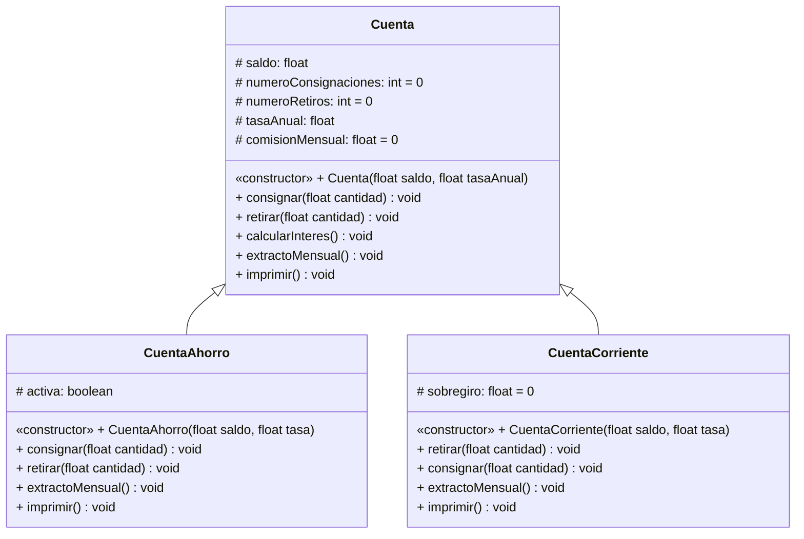

<h1 align="center">Ejercicio Herencia Cuenta Bancaria</h1>

## JEAN PAUL ROJAS HERRERA

### Diagrama de Clases (Mermaid)

```mermaid
classDiagram
    class Cuenta {
        # saldo: float
        # numeroConsignaciones: int = 0
        # numeroRetiros: int = 0
        # tasaAnual: float
        # comisionMensual: float = 0
        «constructor» + Cuenta(float saldo, float tasaAnual)
        + consignar(float cantidad)void
        + retirar(float cantidad)void
        + calcularInteres()void
        + extractoMensual()void
        + imprimir()void
    }
    class CuentaAhorro {
        # activa: boolean
        «constructor» + CuentaAhorro(float saldo, float tasa)
        + consignar(float cantidad)void
        + retirar(float cantidad)void
        + extractoMensual()void
        + imprimir()void
    }
    class CuentaCorriente {
        # sobregiro: float = 0
        «constructor» + CuentaCorriente(float saldo, float tasa)
        + retirar(float cantidad)void
        + consignar(float cantidad)void
        + extractoMensual()void
        + imprimir()void
    }
    Cuenta <|-- CuentaAhorro
    Cuenta <|-- CuentaCorriente
```