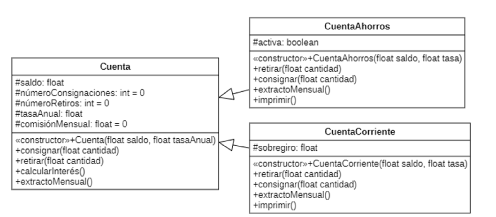
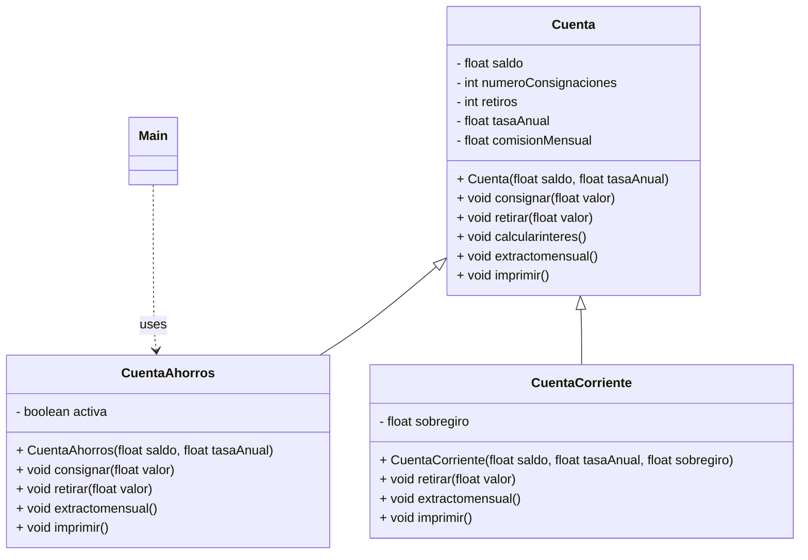

# Ejercicio Herencia Cuenta Bancaria
## MICHAEL DOWGLAS LENIS CHAGUENDO

## Diagrama UML (Mermaid)

```mermaid
classDiagram
    class Cuenta {
        - float saldo
        - int numeroConsignaciones
        - int retiros
        - float tasaAnual
        - float comisionMensual
        + Cuenta(float saldo, float tasaAnual)
        + void consignar(float valor)
        + void retirar(float valor)
        + void calcularinteres()
        + void extractomensual()
        + void imprimir()
    }

    class CuentaAhorros {
        - boolean activa
        + CuentaAhorros(float saldo, float tasaAnual)
        + void consignar(float valor)
        + void retirar(float valor)
        + void extractomensual()
        + void imprimir()
    }

    class CuentaCorriente {
        - float sobregiro
        + CuentaCorriente(float saldo, float tasaAnual, float sobregiro)
        + void retirar(float valor)
        + void extractomensual()
        + void imprimir()
    }


    Cuenta <|-- CuentaAhorros
    Cuenta <|-- CuentaCorriente
    Main ..> CuentaAhorros : uses
```

