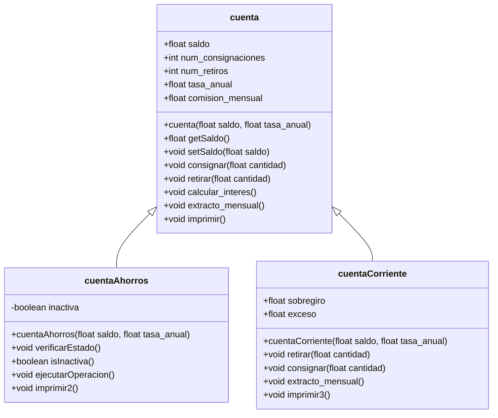

# Ejercicio Herencia Cuenta Bancaria

## Miguel Angel Londoño Alvear 

## Diagrama de Clases

```mermaid
classDiagram
    class cuenta {
        +float saldo
        +int num_consignaciones
        +int num_retiros
        +float tasa_anual
        +float comision_mensual
        +cuenta(float saldo, float tasa_anual)
        +float getSaldo()
        +void setSaldo(float saldo)
        +void consignar(float cantidad)
        +void retirar(float cantidad)
        +void calcular_interes()
        +void extracto_mensual()
        +void imprimir()
    }
    
    class cuentaAhorros {
        -boolean inactiva
        +cuentaAhorros(float saldo, float tasa_anual)
        +void verificarEstado()
        +boolean isInactiva()
        +void ejecutarOperacion()
        +void imprimir2()
    }
    
    class cuentaCorriente {
        +float sobregiro
        +float exceso
        +cuentaCorriente(float saldo, float tasa_anual)
        +void retirar(float cantidad)
        +void consignar(float cantidad)
        +void extracto_mensual()
        +void imprimir3()
    }
    
    cuenta <|-- cuentaAhorros
    cuenta <|-- cuentaCorriente
```

