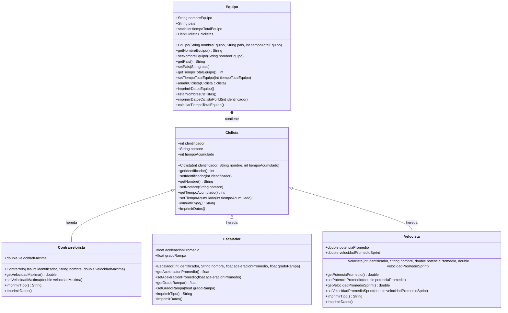

# Ejercicio Clases Abstractas

# Diagrama de Clases

```mermaid
classDiagram
    class Ciclista {
        +int identificador
        +String nombre
        +int tiempoAcumulado
        +Ciclista(int identificador, String nombre, int tiempoAcumulado)
        +getIdentificador() int
        +setIdentificador(int identificador)
        +getNombre() String
        +setNombre(String nombre)
        +getTiempoAcumulado() int
        +setTiempoAcumulado(int tiempoAcumulado)
        +imprimirTipo()* String
        +ImprimirDatos()
    }

    class Contrarrelojista {
        +double velocidadMaxima
        +Contrarrelojista(int identificador, String nombre, double velocidadMaxima)
        +getVelocidadMaxima() double
        +setVelocidadMaxima(double velocidadMaxima)
        +imprimirTipo() String
        +ImprimirDatos()
    }

    class Escalador {
        +float aceleracionPromedio
        +float gradoRampa
        +Escalador(int identificador, String nombre, float aceleracionPromedio, float gradoRampa)
        +getAceleracionPromedio() float
        +setAceleracionPromedio(float aceleracionPromedio)
        +getGradoRampa() float
        +setGradoRampa(float gradoRampa)
        +imprimirTipo() String
        +ImprimirDatos()
    }

    class Velocista {
        +double potenciaPromedio
        +double velocidadPromedioSprint
        +Velocista(int identificador, String nombre, double potenciaPromedio, double velocidadPromedioSprint)
        +getPotenciaPromedio() double
        +setPotenciaPromedio(double potenciaPromedio)
        +getVelocidadPromedioSprint() double
        +setVelocidadPromedioSprint(double velocidadPromedioSprint)
        +imprimirTipo() String
        +ImprimirDatos()
    }

    class Equipo {
        +String nombreEquipo
        +String pais
        +static int tiempoTotalEquipo
        +List~Ciclista~ ciclistas
        +Equipo(String nombreEquipo, String pais, int tiempoTotalEquipo)
        +getNombreEquipo() String
        +setNombreEquipo(String nombreEquipo)
        +getPais() String
        +setPais(String pais)
        +getTiempoTotalEquipo() int
        +setTiempoTotalEquipo(int tiempoTotalEquipo)
        +añadirCiclista(Ciclista ciclista)
        +imprimirDatosEquipo()
        +listarNombresCiclistas()
        +imprimirDatosCiclistaPorId(int identificador)
        +calcularTiempoTotalEquipo()
    }

    Ciclista <|-- Contrarrelojista : hereda
    Ciclista <|-- Escalador : hereda
    Ciclista <|-- Velocista : hereda
    Equipo *-- Ciclista : contiene
```

